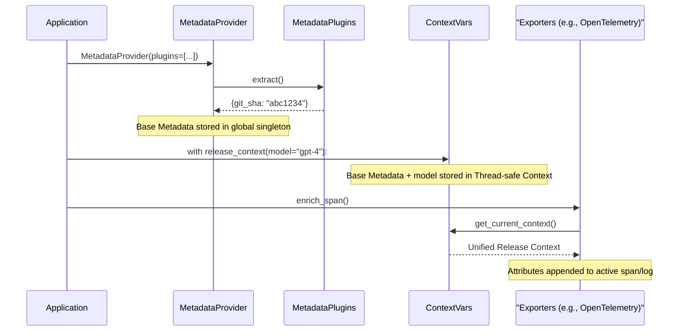

# Architecture

`ai-release-metadata` is designed around a clean, unidirectional data flow: **Sources -> Context Propagation -> Exporters**.

## High-Level Flow

## Context Propagation

The SDK uses Python's native `contextvars` to manage state. This is crucial for modern asynchronous frameworks like FastAPI or AsyncIO.

Instead of passing an `ai_context` object down through 10 layers of function arguments, `with release_context(...)` sets a context variable that is implicitly available to any deeply-nested function running on that same logical thread/task.

When an exporter (like `enrich_span()`) is called, it simply retrieves the active context from `contextvars` and serializes it.
